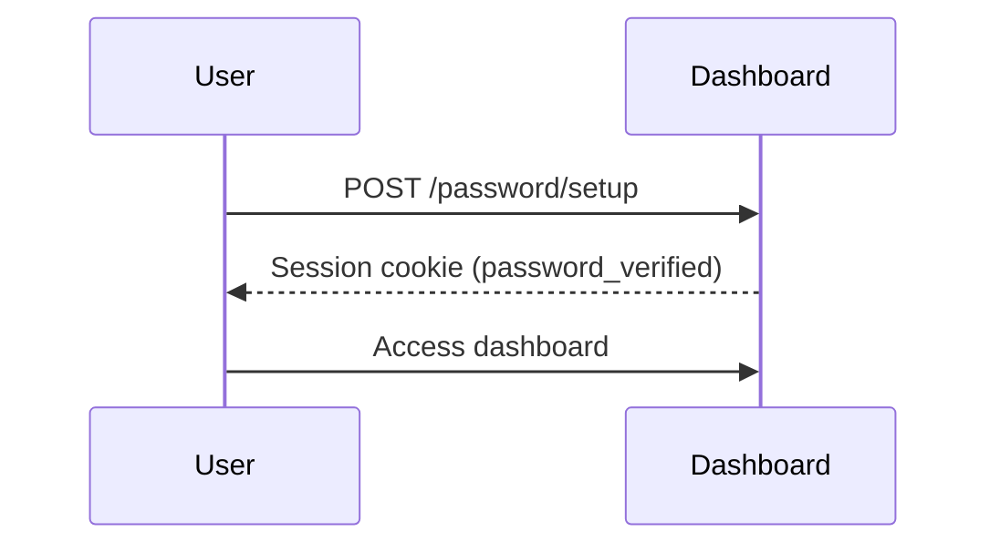
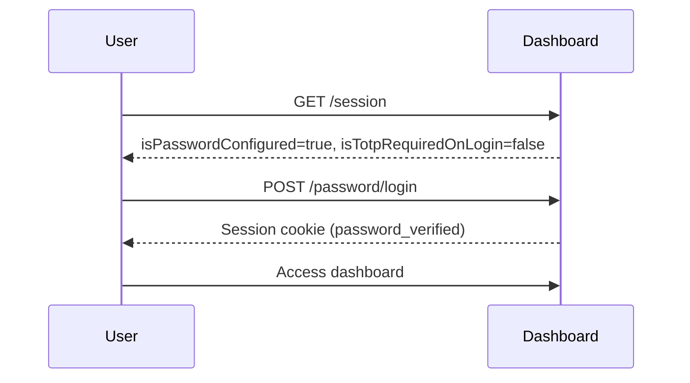
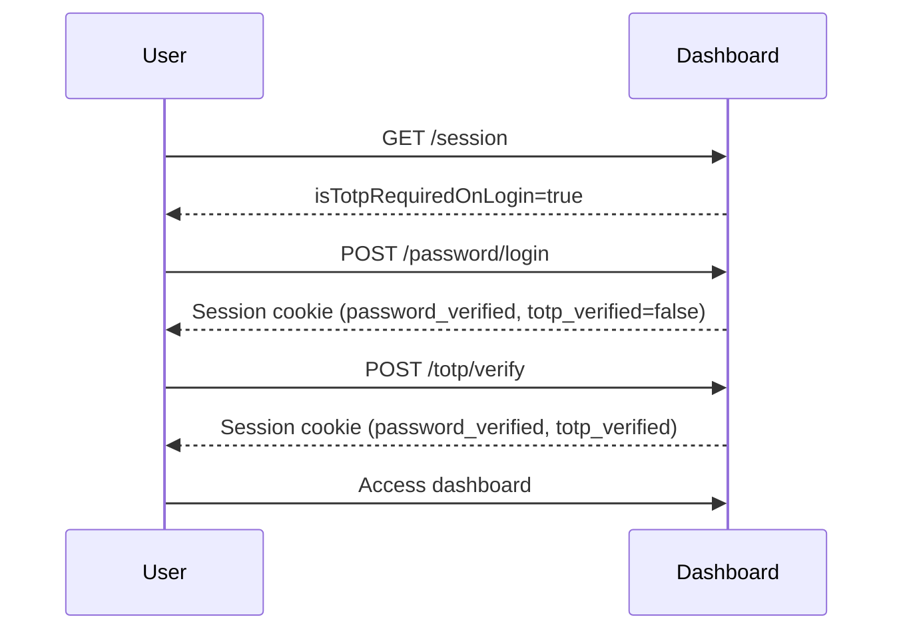

## Overview

The Dashboard Authentication API manages password and two-factor authentication (TOTP) for accessing the Codex-LB web dashboard and management APIs.

<Warning>
Dashboard authentication is separate from API key authentication. API keys are for proxy endpoints, while dashboard auth is for management endpoints.
</Warning>

## GET /api/dashboard-auth/session

Get the current dashboard authentication session state.

### Response

<ResponseField name="isPasswordConfigured" type="boolean">
  Whether a password has been set up
</ResponseField>

<ResponseField name="isPasswordVerified" type="boolean">
  Whether the current session has verified the password
</ResponseField>

<ResponseField name="isTotpConfigured" type="boolean">
  Whether TOTP 2FA is configured
</ResponseField>

<ResponseField name="isTotpVerified" type="boolean">
  Whether the current session has verified TOTP
</ResponseField>

<ResponseField name="isTotpRequiredOnLogin" type="boolean">
  Whether TOTP is required for dashboard access
</ResponseField>

### Example Request

```bash cURL
curl http://localhost:2455/api/dashboard-auth/session
```

### Example Response

```json
{
  "isPasswordConfigured": true,
  "isPasswordVerified": false,
  "isTotpConfigured": true,
  "isTotpVerified": false,
  "isTotpRequiredOnLogin": true
}
```

## POST /api/dashboard-auth/password/setup

Set up the initial dashboard password. Can only be called once.

### Request Body

<ParamField path="password" type="string" required>
  Password to set. Must be at least 8 characters.
</ParamField>

### Response

Returns session state after successful setup. Sets `dashboard_session` cookie.

### Example Request

```bash cURL
curl -X POST http://localhost:2455/api/dashboard-auth/password/setup \
  -H "Content-Type: application/json" \
  -d '{"password": "your-secure-password"}'
```

## POST /api/dashboard-auth/password/login

Authenticate with the dashboard password.

### Request Body

<ParamField path="password" type="string" required>
  Dashboard password
</ParamField>

### Response

Returns session state after successful login. Sets `dashboard_session` cookie.

### Rate Limiting

Password login is rate-limited to **8 attempts per 60 seconds** per IP address.

### Example Request

```bash cURL
curl -X POST http://localhost:2455/api/dashboard-auth/password/login \
  -H "Content-Type: application/json" \
  -d '{"password": "your-password"}'
```

## POST /api/dashboard-auth/password/change

Change the dashboard password. Requires active password session.

### Request Body

<ParamField path="currentPassword" type="string" required>
  Current password for verification
</ParamField>

<ParamField path="newPassword" type="string" required>
  New password to set. Must be at least 8 characters.
</ParamField>

### Example Request

```bash cURL
curl -X POST http://localhost:2455/api/dashboard-auth/password/change \
  -H "Content-Type: application/json" \
  -H "Cookie: dashboard_session=<session_id>" \
  -d '{"currentPassword": "old-password", "newPassword": "new-password"}'
```

## DELETE /api/dashboard-auth/password

Remove the dashboard password. Requires active password session.

<Warning>
Removing the password disables all authentication. Anyone will be able to access the dashboard.
</Warning>

### Request Body

<ParamField path="password" type="string" required>
  Current password for confirmation
</ParamField>

### Example Request

```bash cURL
curl -X DELETE http://localhost:2455/api/dashboard-auth/password \
  -H "Content-Type: application/json" \
  -H "Cookie: dashboard_session=<session_id>" \
  -d '{"password": "current-password"}'
```

## POST /api/dashboard-auth/totp/setup/start

Start TOTP (two-factor authentication) setup. Requires active password session.

### Response

<ResponseField name="secret" type="string">
  TOTP secret key in base32 format
</ResponseField>

<ResponseField name="qrCodeDataUrl" type="string">
  Data URL for QR code image to scan with authenticator app
</ResponseField>

<ResponseField name="setupToken" type="string">
  Token to use when confirming TOTP setup
</ResponseField>

### Example Request

```bash cURL
curl -X POST http://localhost:2455/api/dashboard-auth/totp/setup/start \
  -H "Cookie: dashboard_session=<session_id>"
```

### Example Response

```json
{
  "secret": "JBSWY3DPEHPK3PXP",
  "qrCodeDataUrl": "data:image/png;base64,iVBORw0KGgoAAAANS...",
  "setupToken": "temp_token_abc123"
}
```

## POST /api/dashboard-auth/totp/setup/confirm

Complete TOTP setup by verifying a code from the authenticator app.

### Request Body

<ParamField path="setupToken" type="string" required>
  Setup token from `/totp/setup/start`
</ParamField>

<ParamField path="code" type="string" required>
  6-digit code from authenticator app
</ParamField>

### Example Request

```bash cURL
curl -X POST http://localhost:2455/api/dashboard-auth/totp/setup/confirm \
  -H "Content-Type: application/json" \
  -H "Cookie: dashboard_session=<session_id>" \
  -d '{"setupToken": "temp_token_abc123", "code": "123456"}'
```

## POST /api/dashboard-auth/totp/verify

Verify a TOTP code to complete dashboard login.

### Request Body

<ParamField path="code" type="string" required>
  6-digit code from authenticator app
</ParamField>

### Response

Returns session state after successful verification. Updates `dashboard_session` cookie.

### Rate Limiting

TOTP verification is rate-limited to **8 attempts per 60 seconds** per IP address.

### Example Request

```bash cURL
curl -X POST http://localhost:2455/api/dashboard-auth/totp/verify \
  -H "Content-Type: application/json" \
  -H "Cookie: dashboard_session=<session_id>" \
  -d '{"code": "123456"}'
```

## POST /api/dashboard-auth/totp/disable

Disable TOTP two-factor authentication. Requires active password session.

### Example Request

```bash cURL
curl -X POST http://localhost:2455/api/dashboard-auth/totp/disable \
  -H "Cookie: dashboard_session=<session_id>"
```

## POST /api/dashboard-auth/logout

Log out and invalidate the current dashboard session.

### Example Request

```bash cURL
curl -X POST http://localhost:2455/api/dashboard-auth/logout \
  -H "Cookie: dashboard_session=<session_id>"
```

## Session Management

### Session Cookie

Authenticated sessions are stored in a cookie named `dashboard_session`:

- **HTTPOnly**: Yes (not accessible via JavaScript)
- **Secure**: Yes (HTTPS only in production)
- **SameSite**: Lax
- **Max-Age**: 12 hours (43200 seconds)
- **Encryption**: AES-256-GCM

### Session State

Each session tracks:
- `password_verified` - Whether password was authenticated
- `totp_verified` - Whether TOTP was verified (if enabled)

<Note>
If TOTP is required (`isTotpRequiredOnLogin: true`), both `password_verified` and `totp_verified` must be true to access protected endpoints.
</Note>

## Error Codes

| Code | Status | Description |
|------|--------|-------------|
| `authentication_required` | 401 | Session invalid or not authenticated |
| `invalid_credentials` | 401 | Password incorrect |
| `totp_required` | 401 | TOTP verification needed |
| `totp_invalid_code` | 400 | TOTP code incorrect |
| `password_already_configured` | 409 | Password already set up |
| `password_not_configured` | 400 | Password not yet configured |
| `totp_already_configured` | 409 | TOTP already enabled |
| `totp_not_configured` | 400 | TOTP not enabled |
| `rate_limit_exceeded` | 429 | Too many failed attempts |
| `validation_error` | 400 | Invalid request (e.g., password too short) |

## Authentication Flow

### Initial Setup



### Login (Password Only)



### Login (Password + TOTP)



## Related

- [Features → Dashboard Auth](/features/dashboard-auth) - Overview and configuration
- [Configuration → Environment Variables](/configuration/environment-variables) - Session encryption settings
- [API Keys Management](/api/api-keys-management) - Separate API key authentication