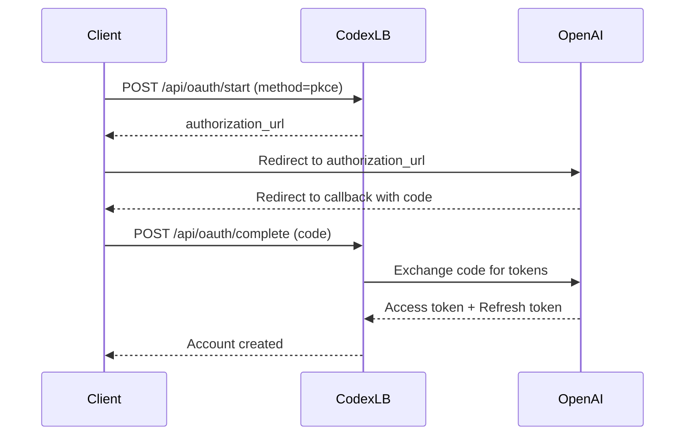
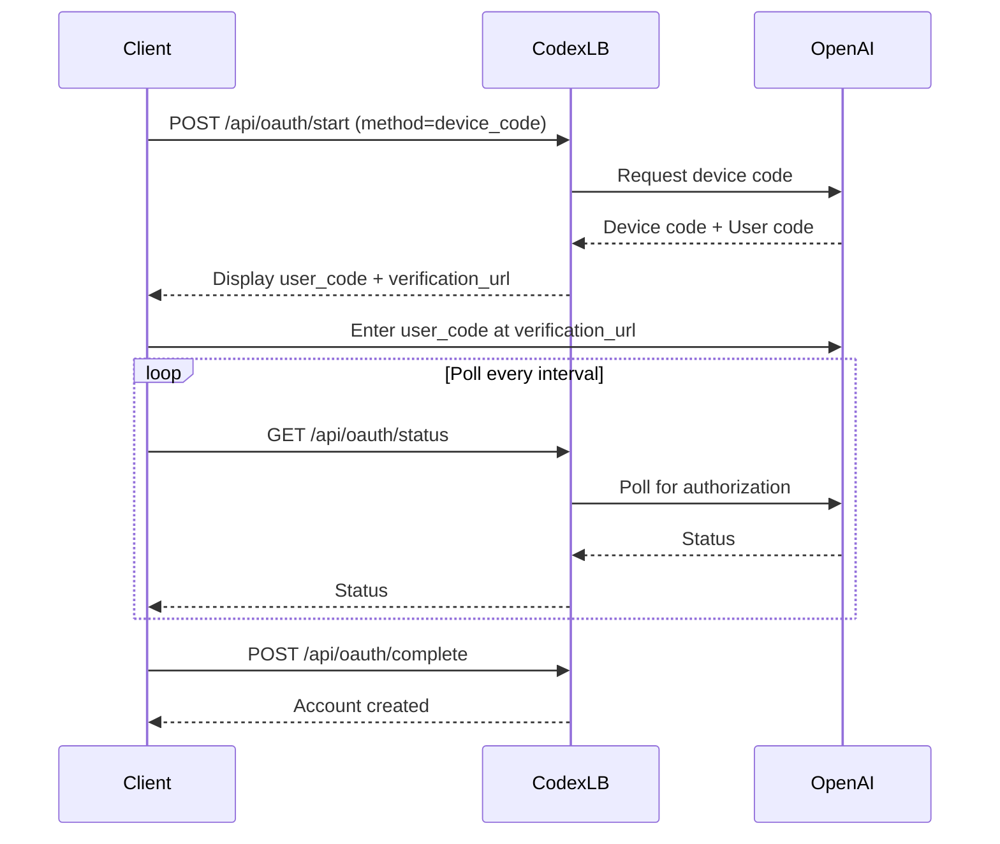

## Overview

The OAuth API manages the authentication flow for adding ChatGPT accounts to Codex-LB. It supports both browser-based PKCE flow and device code flow.

<Note>
All OAuth endpoints require dashboard authentication. See [Dashboard Auth](/api/dashboard-auth) for login details.
</Note>

## POST /api/oauth/start

Initiate an OAuth flow to add a new ChatGPT account.

### Request Body

<ParamField path="method" type="string" required>
  OAuth method to use. Options:
  - `"pkce"` - Browser-based PKCE flow (recommended)
  - `"device_code"` - Device code flow for headless environments
</ParamField>

### Response

<ResponseField name="method" type="string">
  The OAuth method being used (`"pkce"` or `"device_code"`)
</ResponseField>

<ResponseField name="authorization_url" type="string">
  For PKCE: URL to redirect the user to for authorization
</ResponseField>

<ResponseField name="device_code" type="string">
  For device code: The device code to enter at the verification URL
</ResponseField>

<ResponseField name="user_code" type="string">
  For device code: User-friendly code to display
</ResponseField>

<ResponseField name="verification_url" type="string">
  For device code: URL where the user enters the code
</ResponseField>

<ResponseField name="expires_in" type="integer">
  For device code: Time in seconds until the code expires
</ResponseField>

<ResponseField name="interval" type="integer">
  For device code: Polling interval in seconds
</ResponseField>

### Example Request

```bash cURL
curl -X POST http://localhost:2455/api/oauth/start \
  -H "Content-Type: application/json" \
  -H "Cookie: dashboard_session=<session_id>" \
  -d '{"method": "pkce"}'
```

### Example Response (PKCE)

```json
{
  "method": "pkce",
  "authorization_url": "https://auth.openai.com/authorize?client_id=...&code_challenge=..."
}
```

### Example Response (Device Code)

```json
{
  "method": "device_code",
  "device_code": "NGU5OWM1YzQtMjExOC00...",
  "user_code": "ABCD-EFGH",
  "verification_url": "https://auth.openai.com/activate",
  "expires_in": 900,
  "interval": 5
}
```

## GET /api/oauth/status

Check the status of an ongoing OAuth flow.

### Response

<ResponseField name="status" type="string">
  Current OAuth status:
  - `"pending"` - Waiting for user authorization
  - `"completed"` - Authorization successful
  - `"failed"` - Authorization failed
  - `"none"` - No active OAuth flow
</ResponseField>

<ResponseField name="error" type="string" optional>
  Error message if status is `"failed"`
</ResponseField>

### Example Request

```bash cURL
curl http://localhost:2455/api/oauth/status \
  -H "Cookie: dashboard_session=<session_id>"
```

### Example Response

```json
{
  "status": "pending"
}
```

## POST /api/oauth/complete

Complete the OAuth flow and add the account.

### Request Body

<ParamField path="code" type="string" optional>
  For PKCE: Authorization code from the callback
</ParamField>

<ParamField path="state" type="string" optional>
  For PKCE: State parameter from the callback
</ParamField>

### Response

<ResponseField name="success" type="boolean">
  Whether the account was successfully added
</ResponseField>

<ResponseField name="account_id" type="string">
  ID of the newly created account
</ResponseField>

<ResponseField name="email" type="string">
  Email address associated with the account
</ResponseField>

### Example Request

```bash cURL
curl -X POST http://localhost:2455/api/oauth/complete \
  -H "Content-Type: application/json" \
  -H "Cookie: dashboard_session=<session_id>" \
  -d '{"code": "auth_code_here", "state": "state_here"}'
```

### Example Response

```json
{
  "success": true,
  "account_id": "550e8400-e29b-41d4-a716-446655440000",
  "email": "user@example.com"
}
```

## Error Codes

| Code | Status | Description |
|------|--------|-------------|
| `oauth_error` | 502 | Upstream OAuth provider error |
| `not_implemented` | 501 | OAuth method not implemented |
| `authentication_required` | 401 | Dashboard session invalid or expired |
| `authorization_pending` | 400 | Authorization not yet completed |
| `expired_token` | 400 | Authorization code or device code expired |

## OAuth Flow Diagrams

### PKCE Flow



### Device Code Flow



## Related

- [Guides → Adding Accounts](/guides/adding-accounts) - Step-by-step guide for adding accounts
- [Configuration → OAuth](/configuration/oauth) - OAuth configuration settings
- [Dashboard Auth](/api/dashboard-auth) - Dashboard authentication