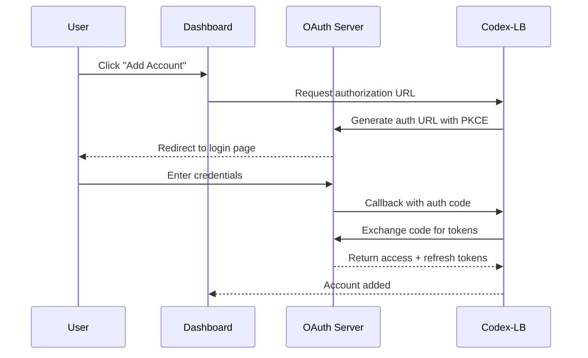

Codex-LB uses OAuth 2.0 to authenticate ChatGPT accounts and automatically refreshes tokens to keep them valid. This page explains the OAuth flow, configuration options, and how to handle different deployment scenarios.

## OAuth Flow Overview

Codex-LB supports two OAuth authentication methods:

1. **Browser Authorization Flow**: User logs in via browser (default)
2. **Device Code Flow**: User enters a code on a separate device

### Authorization Code Flow



## OAuth Configuration Variables

<ParamField path="CODEX_LB_AUTH_BASE_URL" type="string" default="https://auth.openai.com">
  Base URL for the OpenAI authentication service.
  
  <Warning>
  Do not change this unless you're using a custom authentication server or testing environment.
  </Warning>
</ParamField>

<ParamField path="CODEX_LB_OAUTH_CLIENT_ID" type="string" default="app_EMoamEEZ73f0CkXaXp7hrann">
  OAuth client ID for OpenAI authentication.
  
  <Warning>
  **Do not change this value.** This is OpenAI's official Codex CLI client ID. Using a different client ID will break authentication.
  </Warning>
</ParamField>

<ParamField path="CODEX_LB_OAUTH_SCOPE" type="string" default="openid profile email">
  OAuth scopes to request during authorization. Codex-LB automatically adds `offline_access` to obtain refresh tokens.
  
  The full scope sent to OpenAI is: `openid profile email offline_access`
</ParamField>

<ParamField path="CODEX_LB_OAUTH_REDIRECT_URI" type="string" default="http://localhost:1455/auth/callback">
  OAuth redirect URI for the authorization callback.
  
  **Important considerations:**
  - Must match the registered redirect URI for the OAuth client
  - Use `http://localhost:1455/auth/callback` for local development
  - For remote deployments, see [Remote Access Setup](#remote-access-setup)
</ParamField>

<ParamField path="CODEX_LB_OAUTH_CALLBACK_HOST" type="string" default="127.0.0.1">
  Host address for the OAuth callback server to bind to.
  
  - **Local development**: `127.0.0.1` (default)
  - **Docker**: `0.0.0.0` (automatically set in containers)
  - **Remote server**: `0.0.0.0` (listen on all interfaces)
</ParamField>

<ParamField path="CODEX_LB_OAUTH_CALLBACK_PORT" type="integer" default="1455">
  Port for the OAuth callback server.
  
  <Warning>
  **Do not change this port.** OpenAI requires callbacks on port 1455. Changing it will break OAuth authentication.
  </Warning>
</ParamField>

<ParamField path="CODEX_LB_OAUTH_TIMEOUT_SECONDS" type="float" default="30.0">
  Timeout in seconds for OAuth authorization and token exchange requests.
</ParamField>

## Token Refresh Configuration

Codex-LB automatically refreshes account tokens to prevent them from expiring.

<ParamField path="CODEX_LB_TOKEN_REFRESH_TIMEOUT_SECONDS" type="float" default="30.0">
  Timeout in seconds for token refresh requests.
</ParamField>

<ParamField path="CODEX_LB_TOKEN_REFRESH_INTERVAL_DAYS" type="integer" default="8">
  Interval in days between automatic token refreshes.
  
  Codex-LB refreshes tokens every 8 days by default to keep them valid. OpenAI refresh tokens typically expire after 14-30 days of inactivity.
</ParamField>

### How Token Refresh Works

1. **Background Scheduler**: Codex-LB runs a background task that checks all accounts
2. **Refresh Check**: For each account, it checks if `current_time - last_refresh > REFRESH_INTERVAL_DAYS`
3. **Refresh Request**: If refresh is needed, Codex-LB sends a refresh token request to OpenAI
4. **Token Update**: New access token, refresh token, and ID token are encrypted and stored
5. **Error Handling**: If refresh fails permanently (token expired/revoked), the account is marked for re-authentication

### Permanent Refresh Errors

These errors require the user to re-authenticate:

- `refresh_token_expired`: Refresh token has expired
- `refresh_token_reused`: Refresh token was used more than once
- `refresh_token_invalidated`: User revoked access or changed password

<Tip>
Codex-LB displays a warning in the dashboard when an account needs re-authentication. Users can click "Re-login" to start a new OAuth flow.
</Tip>

## Deployment Scenarios

### Local Development

Default configuration works out of the box:

```bash
CODEX_LB_OAUTH_REDIRECT_URI=http://localhost:1455/auth/callback
CODEX_LB_OAUTH_CALLBACK_HOST=127.0.0.1
CODEX_LB_OAUTH_CALLBACK_PORT=1455
```

Access the dashboard at `http://localhost:2455` and add accounts normally.

### Docker (Local)

For Docker running on localhost:

```bash
docker run -d --name codex-lb \
  -p 2455:2455 \
  -p 1455:1455 \
  -e CODEX_LB_OAUTH_CALLBACK_HOST=0.0.0.0 \
  -v codex-lb-data:/var/lib/codex-lb \
  ghcr.io/soju06/codex-lb:latest
```

Access the dashboard at `http://localhost:2455`.

### Remote Server

For remote deployments, you have two options:

<AccordionGroup>
  <Accordion title="Option 1: SSH Tunnel (Recommended)">
    Use SSH port forwarding to tunnel the callback port to your local machine:
    
    ```bash
    # On your local machine
    ssh -L 1455:localhost:1455 -L 2455:localhost:2455 user@remote-server
    ```
    
    Then access the dashboard at `http://localhost:2455`. OAuth callbacks will be tunneled through SSH.
    
    **Advantages:**
    - No firewall configuration needed
    - No public exposure of callback port
    - Works with default OAuth settings
  </Accordion>
  
  <Accordion title="Option 2: Public Access">
    Expose both the dashboard and callback ports publicly:
    
    ```bash
    # On remote server
    CODEX_LB_OAUTH_CALLBACK_HOST=0.0.0.0
    CODEX_LB_OAUTH_REDIRECT_URI=http://your-server.com:1455/auth/callback
    ```
    
    Configure your firewall to allow:
    - Port 2455 (dashboard)
    - Port 1455 (OAuth callback)
    
    **Security considerations:**
    - Use HTTPS with a reverse proxy (see below)
    - Restrict dashboard access with password + TOTP
    - Consider using firewall IP allowlists
  </Accordion>
</AccordionGroup>

### Reverse Proxy (nginx/Caddy)

For production deployments, use a reverse proxy with HTTPS:

<CodeGroup>
```nginx nginx
server {
    listen 443 ssl http2;
    server_name codex-lb.example.com;
    
    ssl_certificate /path/to/cert.pem;
    ssl_certificate_key /path/to/key.pem;
    
    # Dashboard
    location / {
        proxy_pass http://localhost:2455;
        proxy_set_header Host $host;
        proxy_set_header X-Real-IP $remote_addr;
        proxy_set_header X-Forwarded-For $proxy_add_x_forwarded_for;
        proxy_set_header X-Forwarded-Proto $scheme;
    }
}

server {
    listen 1455 ssl http2;
    server_name codex-lb.example.com;
    
    ssl_certificate /path/to/cert.pem;
    ssl_certificate_key /path/to/key.pem;
    
    # OAuth callback
    location /auth/callback {
        proxy_pass http://localhost:1455;
        proxy_set_header Host $host;
        proxy_set_header X-Real-IP $remote_addr;
        proxy_set_header X-Forwarded-For $proxy_add_x_forwarded_for;
        proxy_set_header X-Forwarded-Proto $scheme;
    }
}
```

```caddy Caddyfile
codex-lb.example.com {
    reverse_proxy localhost:2455
}

codex-lb.example.com:1455 {
    reverse_proxy localhost:1455
}
```
</CodeGroup>

Then set:

```bash
CODEX_LB_OAUTH_REDIRECT_URI=https://codex-lb.example.com:1455/auth/callback
```

<Warning>
If using HTTPS, the redirect URI must use `https://`. OAuth will fail if there's a protocol mismatch.
</Warning>

## PKCE (Proof Key for Code Exchange)

Codex-LB implements PKCE (RFC 7636) for additional security during OAuth authorization:

1. **Code Verifier**: Random 32-byte string generated for each auth request
2. **Code Challenge**: SHA-256 hash of the verifier, sent with authorization request
3. **Verification**: OpenAI verifies the verifier matches the challenge during token exchange

This prevents authorization code interception attacks. PKCE is required by OpenAI's OAuth implementation.

## Device Code Flow

For headless servers or environments without browser access, Codex-LB supports the device code flow:

1. User clicks "Add Account" in dashboard
2. Dashboard displays a verification URL and code
3. User visits the URL on another device and enters the code
4. User authenticates and authorizes access
5. Codex-LB polls OpenAI until authorization is complete

The device code flow is automatically used when the browser flow is unavailable.

## Troubleshooting

### OAuth Redirect Mismatch

```
redirect_uri mismatch
```

**Cause**: The `OAUTH_REDIRECT_URI` doesn't match the registered URI.

**Solution**: Verify the redirect URI exactly matches (including protocol and port):
- Local: `http://localhost:1455/auth/callback`
- Remote: `http://your-server:1455/auth/callback` or `https://your-domain:1455/auth/callback`

### Callback Timeout

```
OAuth callback did not complete within timeout
```

**Causes:**
1. Port 1455 is blocked by firewall
2. OAuth callback server isn't listening
3. User didn't complete authorization in time

**Solutions:**
1. Check firewall rules: `sudo ufw allow 1455/tcp`
2. Verify Codex-LB is running and bound to correct host
3. Increase `OAUTH_TIMEOUT_SECONDS`

### Token Refresh Failures

```
refresh_token_expired
```

**Cause**: Refresh token has expired (usually after 14-30 days of inactivity).

**Solution**: Re-authenticate the account:
1. Go to dashboard → Accounts
2. Find the failed account
3. Click "Re-login"
4. Complete OAuth flow

## Security Best Practices

<CardGroup cols={2}>
  <Card title="Encrypt Tokens" icon="lock">
    Codex-LB encrypts all access and refresh tokens using a key file. Back up `encryption.key` securely.
  </Card>
  
  <Card title="Use HTTPS" icon="shield">
    Always use HTTPS in production to prevent token interception during OAuth callbacks.
  </Card>
  
  <Card title="Restrict Dashboard" icon="user-lock">
    Enable password + TOTP authentication for the dashboard in Settings.
  </Card>
  
  <Card title="Regular Refresh" icon="rotate">
    Keep `TOKEN_REFRESH_INTERVAL_DAYS` at 8 or lower to ensure tokens stay valid.
  </Card>
</CardGroup>