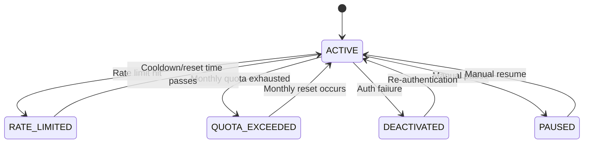

## Overview

Codex-LB pools multiple ChatGPT accounts together, allowing you to distribute API requests across all available accounts. This enables you to:

- **Bypass individual rate limits** by spreading load across multiple accounts
- **Maximize throughput** by leveraging combined quota from all accounts
- **Improve reliability** with automatic account rotation and retry logic
- **Scale capacity** by simply adding more accounts

## How It Works

### Account States

Each account in the pool can be in one of five states:

```python
class AccountStatus:
    ACTIVE = "active"              # Ready to serve requests
    RATE_LIMITED = "rate_limited"  # Temporarily over rate limit
    QUOTA_EXCEEDED = "quota_exceeded"  # Monthly/weekly quota exhausted
    PAUSED = "paused"              # Manually paused by admin
    DEACTIVATED = "deactivated"    # Authentication failed, requires re-login
```

The load balancer automatically tracks these states and selects only `ACTIVE` accounts for serving requests.

### Account Selection Process

When a request arrives, the load balancer follows this selection process:

1. **Filter available accounts** - Exclude deactivated, paused, rate-limited, and quota-exceeded accounts
2. **Apply cooldown logic** - Skip accounts with recent errors (exponential backoff)
3. **Sort by usage** - Order accounts based on the configured routing strategy
4. **Select optimal account** - Pick the account with lowest usage or least recently used
5. **Handle failures** - If the selected account fails, mark it appropriately and retry with another

<Note>
The selection algorithm runs on every request and automatically adapts to changing account states. No manual intervention is required.
</Note>

### State Transitions

Accounts automatically transition between states based on upstream API responses:



### Error Handling & Cooldowns

Codex-LB implements sophisticated error handling to prevent cascading failures:

**Exponential Backoff**: Accounts with repeated errors enter exponential backoff:
```python
# From app/core/balancer/logic.py:82-84
if state.error_count >= 3:
    backoff = min(300, 30 * (2 ** (state.error_count - 3)))
    # Skip account if backoff period hasn't elapsed
```

- Error 3: 30 seconds cooldown
- Error 4: 60 seconds cooldown  
- Error 5: 120 seconds cooldown
- Error 6+: 300 seconds (5 minutes) cooldown

**Rate Limit Recovery**: When an account hits rate limits, the system:
1. Parses `Retry-After` headers from upstream API
2. Sets `cooldown_until` timestamp
3. Automatically reactivates the account when cooldown expires

<Warning>
If all accounts are rate-limited or quota-exceeded, requests will fail with "No available accounts" errors. Monitor your usage dashboard to prevent this scenario.
</Warning>

## Automatic State Recovery

### Rate Limit Reset

The balancer automatically recovers rate-limited accounts:

```python
# From app/core/balancer/logic.py:61-67
if state.status == AccountStatus.RATE_LIMITED:
    if state.reset_at and current >= state.reset_at:
        state.status = AccountStatus.ACTIVE
        state.error_count = 0
        state.reset_at = None
```

When `reset_at` time is reached, the account immediately returns to `ACTIVE` status.

### Quota Reset

Similarly, quota-exceeded accounts recover when their monthly window resets:

```python
# From app/core/balancer/logic.py:68-74
if state.status == AccountStatus.QUOTA_EXCEEDED:
    if state.reset_at and current >= state.reset_at:
        state.status = AccountStatus.ACTIVE
        state.used_percent = 0.0
        state.reset_at = None
```

## Permanent Failures

Certain error codes indicate permanent authentication failures that require manual intervention:

```python
# From app/core/balancer/logic.py:11-17
PERMANENT_FAILURE_CODES = {
    "refresh_token_expired": "Refresh token expired - re-login required",
    "refresh_token_reused": "Refresh token was reused - re-login required",
    "refresh_token_invalidated": "Refresh token was revoked - re-login required",
    "account_suspended": "Account has been suspended",
    "account_deleted": "Account has been deleted",
}
```

When these errors occur:
1. Account is marked as `DEACTIVATED`
2. `deactivation_reason` is set with explanation
3. Account is excluded from future requests
4. Admin must re-import the account to restore access

## Account Pooling Best Practices

### Optimal Pool Size

- **Small deployments**: 2-3 accounts provide redundancy and basic load distribution
- **Medium deployments**: 5-10 accounts handle moderate traffic with good headroom
- **Large deployments**: 10+ accounts for high-volume production workloads

### Account Mix

Consider mixing account types for optimal coverage:

- **Plus accounts**: Lower rate limits but sufficient for most use cases
- **Team/Enterprise accounts**: Higher rate limits and quotas for production load
- **Trial accounts**: Temporary capacity during migration or testing

<Tip>
Use the "Prefer earlier reset accounts" setting to prioritize accounts that will reset sooner, maximizing long-term availability.
</Tip>

### Monitoring Pool Health

Regularly check your accounts dashboard for:

- Deactivated accounts requiring re-authentication
- Accounts consistently hitting rate limits (may need upgrade)
- Uneven usage distribution (check routing strategy)
- Error patterns across multiple accounts (upstream API issues)

## Related Features

- [Load Balancing](/features/load-balancing) - Configure how requests are distributed
- [Usage Tracking](/features/usage-tracking) - Monitor account consumption
- [Dashboard Auth](/features/dashboard-auth) - Secure your admin dashboard

## Technical Reference

Key source files:

- `app/core/balancer/logic.py` - Core selection algorithm
- `app/core/balancer/types.py` - Type definitions
- `app/modules/proxy/load_balancer.py` - Load balancer implementation
- `app/modules/accounts/repository.py` - Account persistence
